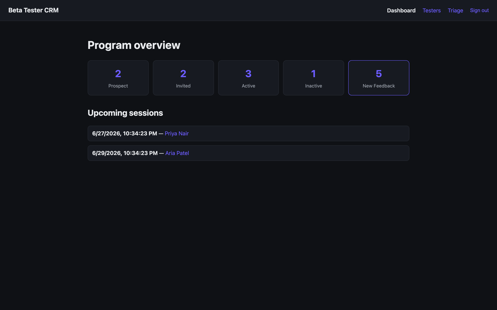
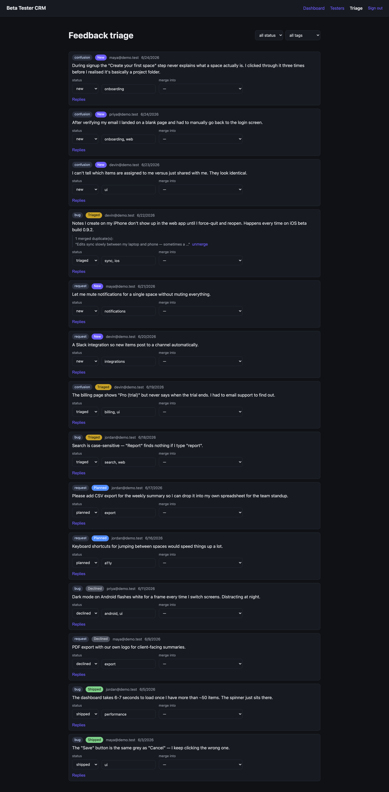
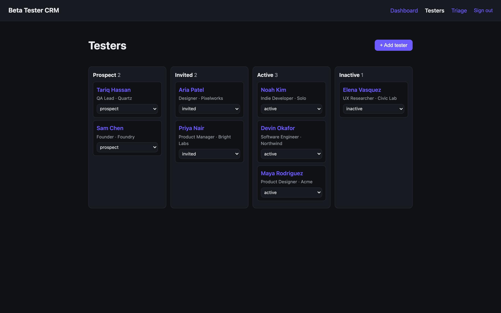
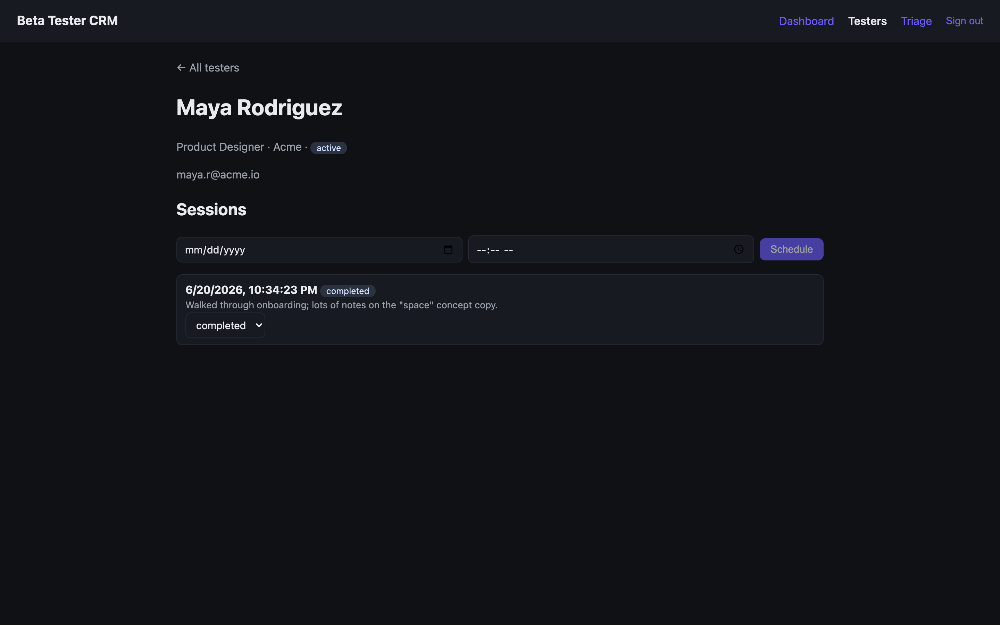
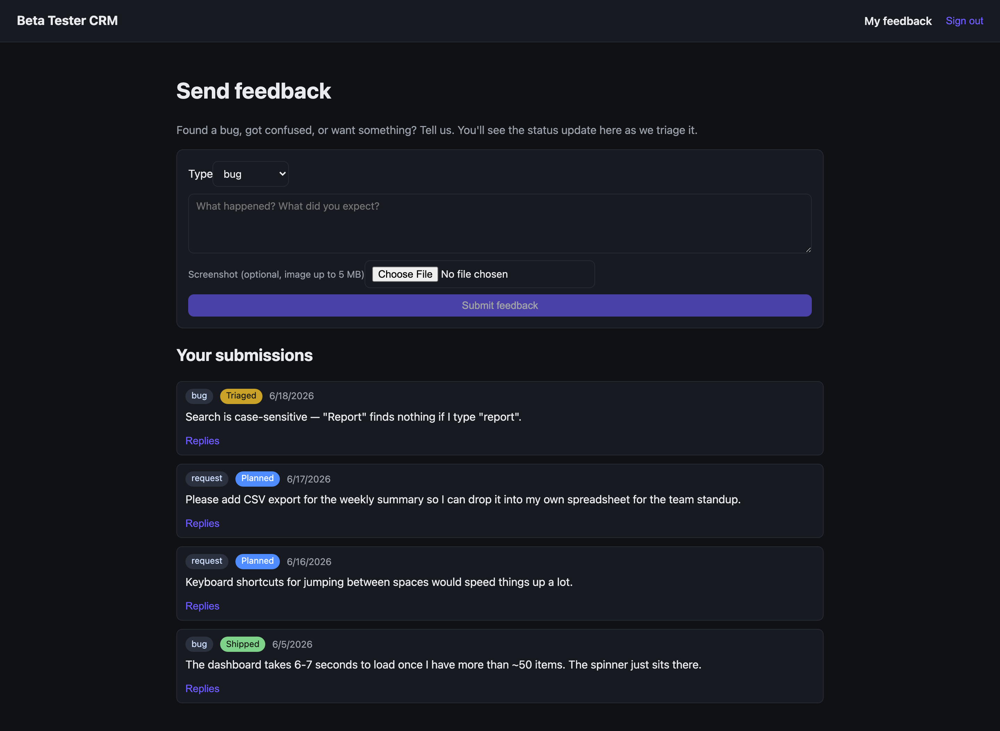

# Beta Tester CRM + Feedback Portal

[](https://github.com/viskikex/beta-tester-crm/actions/workflows/ci.yml)

Two tools in one app, gated by role:

- **Admin (program manager).** Recruit testers, move them through a pipeline, schedule
  feedback sessions, and triage incoming feedback (set status, tag, merge duplicates, filter).
- **Tester.** Submit feedback (bug, confusion, or request, with an optional screenshot),
  edit or withdraw it before triage, reply in a thread, and watch the status of your own
  submissions.

I built this security-first. The access rules live in the database as Postgres RLS, not
only in the React UI, so the same boundary holds whether you go through the app or hit the
API directly. React + Supabase.

[](docs/img/02-dashboard.png)

<sub>Admin program dashboard — pipeline counts, new-feedback volume, upcoming sessions. More views in [Screenshots](#screenshots).</sub>

## How this was built

I built this with Claude Code as my editor. The security-first scope, the adversarial prompting, and the decision to keep access rules in Postgres RLS instead of only the UI were mine. I tested the boundaries by trying to break them; the code is the artifact, but the checking is the part I could actually do myself.

## What it demonstrates

The headline is the security model. [`docs/ARCHITECTURE.md`](docs/ARCHITECTURE.md) is the
full tour; this is the short version.

- **Role-based access control.** A `profiles.is_admin` flag drives two things: route gating
  in the auth context (testers can't reach the admin views), and RLS in the database. The
  boundary holds whether you go through the UI or hit the API.
- **Recursion-safe RLS.** The `is_admin()` helper is `SECURITY DEFINER` so the `profiles`
  SELECT policy can call it without looping forever. The comment in `0002_feedback_portal.sql`
  walks through it. This is the classic Supabase footgun, handled.
- **Owner-scoped RLS.** The CRM tables (`testers`, `sessions`) use the simpler
  `auth.uid() = owner` pattern, so the repo shows both RLS models next to each other.
- **Column-pinned writes.** A tester can edit or withdraw their own feedback, but only while
  it's `status='new'`, and the policies pin `status`/`tags`/`merged_into` so they can't
  self-promote a submission to `shipped` or seed tags. Triage stays admin-only at the
  database, not just in the UI (`0005`, `0006`, `0009`).
- **Stored-XSS defense in depth.** The legacy `screenshot_url` is user-controlled and React
  doesn't sanitize `href`, so a `javascript:` URL would run in the admin's session at triage.
  I guard it twice: `safeUrl()` at render (`src/lib/safeUrl.ts`), and a DB `CHECK` so the rule
  survives a direct anon-key write (`0004`).
- **SECURITY DEFINER hardening.** Every helper pins `search_path` and revokes `EXECUTE` from
  `PUBLIC` (`0003`). `is_admin()` and `merge_feedback()` are granted back to `authenticated`
  on purpose: the policies evaluate `is_admin()` as the signed-in user, and `merge_feedback()`
  is the admin triage RPC. Supabase's linter still flags those two as "executable by signed-in
  users," which is expected. Both re-check authorization internally, so calling them directly
  gets you nothing.
- **Server-enforced merge.** Duplicate-merging is one `SECURITY DEFINER` RPC (`0010`) that
  re-checks admin and canonical-target and does both writes in a single transaction, so a
  half-applied merge can't corrupt the dedup tree. A `BEFORE UPDATE` trigger (`0012`)
  re-asserts the same no-self-merge and canonical-target rules at the table, so they hold even
  against a direct admin `UPDATE` that skips the RPC.
- **Validation at the DB boundary.** Non-empty, length-capped feedback bodies and an
  email-format check live as `CHECK` constraints (`0011`), so a direct anon-key write gets the
  same integrity the React forms do, not just the forms.

Platform pieces:

- **Supabase Auth.** Email/password, session in React context, with a `handle_new_user()`
  trigger that creates a profile row on sign-up.
- **Supabase Storage.** A private `screenshots` bucket. Testers upload into their own
  `<uid>/…` folder (per-user folder RLS), the app stores only the object path, and viewers get
  a short-lived signed URL (`0008`, `ScreenshotLink.tsx`).
- **Append-only comment threads.** A two-way reply thread per item, with no UPDATE/DELETE
  policy, so the triage conversation stays an honest record (`0007`).
- **Postgres arrays + GIN index.** `tags text[]` with a GIN index (`feedback_tags_idx`); the
  triage tag filter runs through it server-side via `.contains()` (`tags @> ARRAY[tag]`), so
  narrowing the board doesn't ship the whole table to the browser.
- **A pipeline UI** with optimistic updates that roll back on error, plus client-side
  aggregation for the dashboard.

## Screenshots

Same Supabase project, two role-gated surfaces. The tester only ever sees their own
submissions — that's RLS in the database, not a filtered query in the UI.

| Admin · triage board | Admin · tester pipeline |
|:--:|:--:|
| [](docs/img/05-triage.png) | [](docs/img/03-testers.png) |
| Set status, tag, and merge duplicates. | Recruitment kanban: prospect → invited → active → inactive. |
| **Admin · tester detail** | **Tester · submit & track** |
| [](docs/img/04-tester-detail.png) | [](docs/img/06-my-feedback.png) |
| Schedule and log feedback sessions per contact. | The tester's whole world: submit, then watch status. Note they see *only* their own rows. |

## Stack

Vite + React 18 + TypeScript, `@supabase/supabase-js`, `react-router-dom`. Plain CSS.

## Setup

1. **Create a Supabase project** at [supabase.com](https://supabase.com).
2. **Run the migrations in order** (`0001` → `0013`), in the SQL Editor:
   - `0001_init.sql`: testers + sessions
   - `0002_feedback_portal.sql`: profiles, roles, feedback
   - `0003_harden_functions.sql`: `search_path` + EXECUTE hardening
   - `0004_screenshot_url_scheme.sql`: http(s)-only constraint on legacy screenshot URLs
   - `0005_restrict_feedback_insert.sql`: testers submit as `status=new` only
   - `0006_tester_edit_own_feedback.sql`: testers edit/withdraw their own while `new`
   - `0007_feedback_comments.sql`: the reply thread (append-only)
   - `0008_screenshot_storage.sql`: private `screenshots` bucket + per-user upload RLS
   - `0009_feedback_edit_column_lock.sql`: trigger so admin-tagging a `new` item can't brick a tester's edit
   - `0010_merge_feedback_rpc.sql`: `SECURITY DEFINER` RPC that merges duplicates atomically
   - `0011_value_constraints.sql`: server-side value `CHECK`s (non-empty/length-capped body, email format)
   - `0012_feedback_merge_guard.sql`: trigger so the merge invariants hold for a direct admin write, not just the RPC
   - `0013_rls_initplan.sql`: wrap `auth.uid()`/`is_admin()` in `(select …)` so each policy evaluates them once per query, not once per row
   > `0004` will fail if a row already holds a non-http `screenshot_url`. Clean those first.
   > `0010` is required for duplicate-merging: the triage UI calls it via `supabase.rpc('merge_feedback')`, so merge errors until it's applied.
3. **Env vars:** `cp .env.example .env`, then fill in the URL + anon key (Settings → API).
4. **Run it:**
   ```bash
   npm install
   npm run dev
   ```
5. **Sign up.** Your first account lands as a tester, so you'll see only the submission view.
   Submit a couple of items.
6. **Make yourself an admin.** In the SQL Editor:
   ```sql
   update public.profiles set is_admin = true where email = 'you@example.com';
   ```
   Refresh, and you get the Dashboard, Testers, and Triage views.

> To skip email confirmation while hacking: Authentication → Providers → Email →
> "Confirm email" off. Then make a second account to act as a tester while your first one is
> the admin, so you can watch a submission move through triage.

## Where to look first

| File | What it shows |
|------|---------------|
| `supabase/migrations/0002_feedback_portal.sql` | Roles, the `SECURITY DEFINER` helper, two-sided RLS |
| `src/context/AuthContext.tsx` | Loads the profile + exposes `isAdmin` |
| `src/App.tsx` | `RequireAuth` / `RequireAdmin` route gating |
| `src/pages/MyFeedbackPage.tsx` | Tester side: submit + see own status |
| `src/pages/AdminFeedbackPage.tsx` | Admin side: status, tags, merge, filter |
| `supabase/migrations/0008_screenshot_storage.sql` | Private bucket + per-user folder Storage RLS |
| `src/lib/safeUrl.ts` + `0004_*.sql` | The two halves of the XSS defense |

For the full data model and the layered RLS story, see [`docs/ARCHITECTURE.md`](docs/ARCHITECTURE.md).

## Tests

Two layers, one per half of the app:

- **Unit (frontend):** `npm test` (vitest) covers the pure boundary helpers: the `http(s)`
  URL allowlist, the storage-path extension sanitizer + id generator, and the PostgREST
  embed-shape coercion.
- **RLS / policy (database):** [`supabase/tests/rls_smoke.sql`](supabase/tests/rls_smoke.sql)
  asserts the access rules from [`docs/ARCHITECTURE.md`](docs/ARCHITECTURE.md) straight against
  Postgres. A tester sees only their own feedback, can't submit a pre-triaged row or
  self-promote one, can't merge or flip `is_admin`. Testers and their screenshots stay private
  to their owner (the CRM tables have no admin override), comments are append-only, anon sees
  nothing, and the value constraints hold. It simulates signed-in users with
  `request.jwt.claims` + `SET ROLE`, runs in a transaction that rolls back (nothing persists),
  and emits only PASS/FAIL (no PII). Run it against a dev project:

  ```bash
  psql "$DATABASE_URL" -f supabase/tests/rls_smoke.sql
  # …or paste it into the Supabase SQL Editor and Run.
  ```

- **Both, in CI:** [`.github/workflows/ci.yml`](.github/workflows/ci.yml) runs the unit tests
  + build, then stands up the real `supabase/postgres` image, applies all 13 migrations in
  order, seeds an admin + two testers, and runs `rls_smoke.sql` against it on every push. So
  the access rules above are proven green each commit, not just claimed. The CI-only database
  setup (the storage schema, role grants, and seed that a hosted Supabase project provides but
  the bare image doesn't) lives in [`supabase/ci/`](supabase/ci/).

## What I'd build next

- Realtime on `feedback` so the triage board updates live as testers submit.
- Email the submitter when their item ships (an Edge Function on status change).
- An LLM pass to auto-suggest tags from the body.
- Tie a feedback item back to a CRM `tester` record when the emails match.
- Pagination / "load more" on the triage and tester lists (today they fetch all visible rows).

## Known limitations

Scoping calls I made on purpose:

- **No pagination yet.** The list and dashboard views pull every visible row on mount.
  That's fine at demo scale. A real deployment wants range pagination or a "load more,"
  and it's the first thing I'd add.
- **Multi-admin edits are last-write-wins.** The optimistic-update guards protect you
  from your own in-flight races, but if two admins edit the same feedback row at once,
  the second save wins silently. There's no `updated_at` precondition.
- **Admin promotion is SQL-only.** There's no in-app button to make someone an admin,
  and that's deliberate: the `profiles` table has no write policy, so admin can't be
  granted (or self-granted) through the API. You flip `is_admin` in the SQL editor.
- **Screenshot cleanup is best-effort.** If a storage delete fails, the object can
  orphan. There's no garbage collector.
- **Deleting a canonical feedback item un-merges its duplicates.** They fall back to
  standalone (`on delete set null`) rather than re-parenting to another item.

## License

MIT, see [`LICENSE`](LICENSE).
